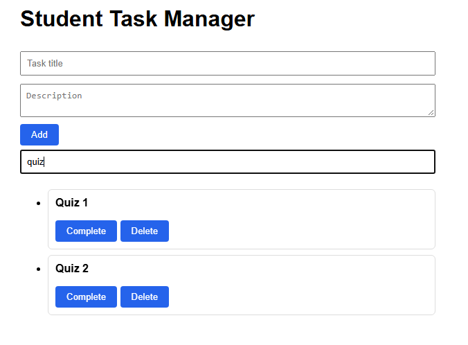

# Student Task Manager

## Description
Student Task Manager is a simple web app where students can add tasks, mark them as done, delete them and search through them. It was built by two students as a Git and GitHub teamwork project for our Intro to Data Science course.

## Team Members
- Thalassophile33 (Student 2): task manager styling, README, task search
- kashafdastgir (Student 1): task input form, task creation, completion and deletion, v1.0.0 release

## Features
- Add tasks with a title and description
- Mark tasks as complete
- Delete tasks
- Search tasks by title
- Styled layout

## Technologies
- HTML, CSS, JavaScript
- Git and GitHub

## Git Workflow
Each feature was built on its own branch, pushed to GitHub and opened as a pull request. Each pull request was reviewed and merged by the other team member. Pull request descriptions used "Closes #" followed by the issue number, so GitHub closed the issue automatically after the merge.

## Branches
- main: the stable version
- feature/task-form: the task input form
- feature/task-style: the task manager styling
- feature/task-core: add, complete and delete tasks
- feature/task-search: the search feature
- docs/readme-title-s1: README title fix (Student 1)
- docs/readme-title-s2: README title fix (Student 2)
- docs/final-readme: this README

## Commands
- git switch: move to or create a branch
- git add: choose the changes to save
- git commit: save a snapshot with a message
- git push: upload commits to GitHub
- git pull: download the latest changes
- git tag: mark a version such as v1.0.0

## GitHub Features
- Issues: tracked each feature, e.g. #2 Implement task search
- Pull requests: proposed and reviewed changes before merging
- Reviews: partner approval before every merge
- Releases and tags: published v1.0.0

## How to Run
1. Download or clone the repository.
2. Open index.html in a web browser.

## Screenshots

## Version History
- v1.0.0: add task form, task list with completion and deletion, task search, styled layout

## Contributors
- Thalassophile33
- kashafdastgir